2019-10-27 NYC Squirrel Census
================

# 2019-10-27 NYC Squirrel Census

This is a great dataset with lots of variables. I’m going to use this
dataset to practise my machine learning techniques.

I’m going to create a model that can accuractely predict if a squirrel
is on the ground or above the ground.

I’m going to be using the tidymodels workflow, and following this
helpful guide:
<https://towardsdatascience.com/modelling-with-tidymodels-and-parsnip-bae2c01c131c>
<https://www.benjaminsorensen.me/post/modeling-with-parsnip-and-tidymodels/>
<https://www.alexpghayes.com/blog/implementing-the-super-learner-with-tidymodels/>

Read in the data

``` r
knitr::opts_chunk$set(
  fig.path = "README_figs/README-"
)
# Load libraries
library(tidyverse)
library(tidymodels)
library(lubridate)
library(forcats)
library(knitr)
library(janitor)
library(xgboost)
```

Now clean the dataset so all the column types are in their correctf
format.

``` r
nyc_squirrels_raw <- readr::read_csv("https://raw.githubusercontent.com/rfordatascience/tidytuesday/master/data/2019/2019-10-29/nyc_squirrels.csv")
```

    ## Parsed with column specification:
    ## cols(
    ##   .default = col_character(),
    ##   long = col_double(),
    ##   lat = col_double(),
    ##   date = col_double(),
    ##   hectare_squirrel_number = col_double(),
    ##   running = col_logical(),
    ##   chasing = col_logical(),
    ##   climbing = col_logical(),
    ##   eating = col_logical(),
    ##   foraging = col_logical(),
    ##   kuks = col_logical(),
    ##   quaas = col_logical(),
    ##   moans = col_logical(),
    ##   tail_flags = col_logical(),
    ##   tail_twitches = col_logical(),
    ##   approaches = col_logical(),
    ##   indifferent = col_logical(),
    ##   runs_from = col_logical(),
    ##   zip_codes = col_double(),
    ##   community_districts = col_double(),
    ##   borough_boundaries = col_double()
    ##   # ... with 2 more columns
    ## )

    ## See spec(...) for full column specifications.

``` r
nyc_squirrels <- nyc_squirrels_raw %>% mutate(shift = as_factor(shift),
                                              date = mdy(date),
                                              age = fct_explicit_na(fct_relevel(age,"Juvenile")),
                                              primary_fur_color = fct_explicit_na(primary_fur_color),
                                              #highlight_fur_color = fct_explicit_na(highlight_fur_color))
                                              location = fct_explicit_na(fct_relevel(location,"Ground Plane")))
# Only interested in the below variables
nyc_squirrels <- nyc_squirrels %>%  select(age,primary_fur_color,location,running,chasing,climbing,eating,foraging, kuks,tail_flags,approaches,indifferent,runs_from)

nyc_squirrels
```

    ## # A tibble: 3,023 x 13
    ##    age   primary_fur_col… location running chasing climbing eating foraging
    ##    <fct> <fct>            <fct>    <lgl>   <lgl>   <lgl>    <lgl>  <lgl>   
    ##  1 (Mis… (Missing)        (Missin… FALSE   FALSE   FALSE    FALSE  FALSE   
    ##  2 Adult Gray             Ground … TRUE    FALSE   FALSE    FALSE  FALSE   
    ##  3 Adult Cinnamon         Above G… FALSE   FALSE   TRUE     FALSE  FALSE   
    ##  4 Juve… Gray             Above G… FALSE   FALSE   TRUE     FALSE  FALSE   
    ##  5 (Mis… (Missing)        Above G… FALSE   FALSE   FALSE    FALSE  FALSE   
    ##  6 Juve… Gray             Ground … FALSE   FALSE   FALSE    FALSE  FALSE   
    ##  7 Adult Gray             Ground … TRUE    TRUE    FALSE    FALSE  FALSE   
    ##  8 (Mis… Gray             Ground … FALSE   FALSE   FALSE    FALSE  TRUE    
    ##  9 Adult Gray             Ground … FALSE   FALSE   FALSE    FALSE  TRUE    
    ## 10 Adult Gray             (Missin… FALSE   FALSE   FALSE    TRUE   TRUE    
    ## # … with 3,013 more rows, and 5 more variables: kuks <lgl>,
    ## #   tail_flags <lgl>, approaches <lgl>, indifferent <lgl>, runs_from <lgl>

Given that there are only 64 missing data points for `location`, I will
remove these. Also, I will remove the 55 missing data points for
`primary_fur_colour`.

``` r
nyc_squirrels %>% count(location)
```

    ## # A tibble: 3 x 2
    ##   location         n
    ##   <fct>        <int>
    ## 1 Ground Plane  2116
    ## 2 Above Ground   843
    ## 3 (Missing)       64

``` r
nyc_squirrels <- nyc_squirrels %>% filter(location != "(Missing)",primary_fur_color != "(Missing)") %>% droplevels()
```

### Benchmark

First we will set a benchmark score to beat with our model by simply
guessing that a squirel will be Above Plane when climbing and Ground
plane when not.

``` r
model_benchmark <- nyc_squirrels %>% 
  mutate(guess = as_factor(if_else(climbing,'Above Ground','Ground Plane'))) %>% 
  accuracy(estimate = guess,truth = location) %>% select(.estimate) %>% pull()
```

Well, it turns out guessing it’s Above Plane if it’s climbing gets you a
accuracy of 0.85.

## Model

### Train and Test Split

Firstly, create a randomised training and test split of the original
data.

``` r
set.seed(seed = 1) 
train_test_split <- initial_split(data = nyc_squirrels,prop = 0.8)

train_set <- training(train_test_split)
test_set <- testing(train_test_split)
```

### Create recipe

Here we prep a recipe for how we want to transform our data and then
apply these steps to the train and test set.

``` r
set.seed(seed = 1) 
recipe <- recipe(location ~ ., data = train_set) %>% 
  step_dummy(primary_fur_color,age,one_hot = T) %>% 
  prep(train_set)

train_baked <- bake(recipe,new_data = train_set)
test_baked <- bake(recipe,new_data = test_set)
```

### Fit the model

``` r
set.seed(seed = 1) 
boost_tree <- boost_tree(mode = "classification") %>% 
  set_engine("xgboost") %>% 
  fit(location ~ ., data = train_baked)

importance <- xgb.importance(feature_names = colnames(train_baked %>% select(-location)),model = boost_tree$fit)

xgb.plot.importance(importance)
```

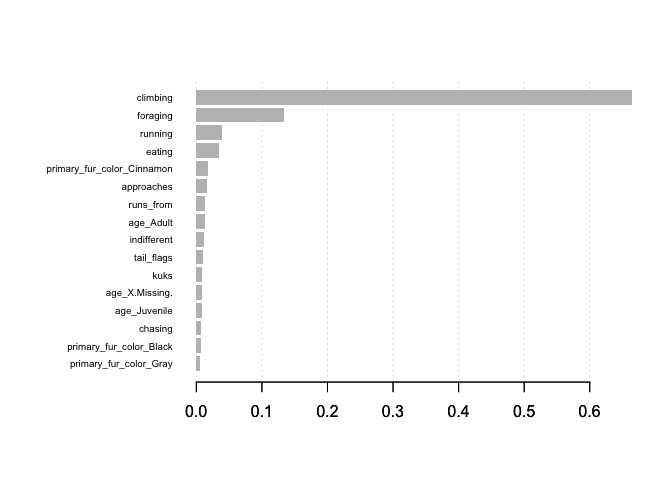<!-- -->

### Performance Assesment

``` r
predictions_xgb <- boost_tree %>% 
  predict(new_data = test_baked) %>% 
  bind_cols(test_baked %>% select(location))
```

There are several metrics that can be used to investigate the
performance of a classification model but for simplicity I’m only
focusing on a selection of them: accuracy, precision, recall and
F1\_Score.

``` r
predictions_xgb %>%
  conf_mat(location, .pred_class) %>%
  pluck(1) %>%
  as_tibble() %>%
  ggplot(aes(Prediction, Truth, alpha = n)) +
  geom_tile(show.legend = FALSE) +
  geom_text(aes(label = n), colour = "white", alpha = 1, size = 8)
```

<!-- -->

``` r
model_metrics <- predictions_xgb %>%
  conf_mat(location, .pred_class) %>% summary() %>% 
  select(-.estimator) %>%
  filter(.metric %in%
    c("accuracy", "precision", "recall", "f_meas"))

model_accuracy <- model_metrics %>% filter(.metric == "accuracy") %>% select(.estimate) %>% pull()
model_metrics %>%
  kable(digits = 2)
```

| .metric   | .estimate |
| :-------- | --------: |
| accuracy  |      0.84 |
| precision |      0.85 |
| recall    |      0.95 |
| f\_meas   |      0.90 |

It seems our model score of 0.84 is worse than the benchmark set.

``` r
boost_tree %>% 
  predict(new_data = test_baked,type = "prob") %>% clean_names %>% select(pred_ground_plane) %>% 
  bind_cols(test_baked %>% select(location)) %>% 
  gain_curve(truth = location,pred_ground_plane) %>% autoplot()
```

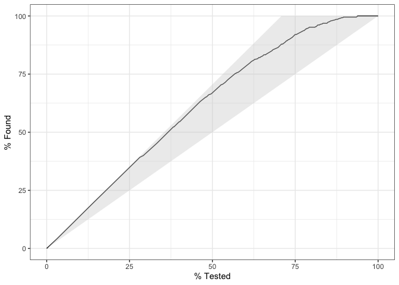<!-- -->

### Hyper Parameter Tuning

Create a random grid of parameters object values. Parameters we can tune
can be found here:
<https://tidymodels.github.io/parsnip/reference/boost_tree.html>

Guide:

*Control Model Complexitiy - max\_depth, min\_child\_weight, and gamma
*Robust to noise - subsample, colsample\_bytree

``` r
library(dials)
set.seed(seed = 1) 

xgb_grid <- grid_random(
trees(c(1,100)), # Number of boosting iterations
min_n(c(1,20)), # Min number of data points in a node to split it further
tree_depth(c(1,20)), # Number of splits
learn_rate(c(0,1),trans = NULL), # eta
loss_reduction(c(0,1),trans = NULL), # gamma
size = 10) %>% mutate(model_id = row_number()) 

xgb_grid
```

    ## # A tibble: 10 x 6
    ##    trees min_n tree_depth learn_rate loss_reduction model_id
    ##  * <int> <int>      <int>      <dbl>          <dbl>    <int>
    ##  1    68     1          5     0.411          0.693         1
    ##  2    39    10          5     0.821          0.478         2
    ##  3     1    14          2     0.647          0.861         3
    ##  4    34    10         10     0.783          0.438         4
    ##  5    87     7         12     0.553          0.245         5
    ##  6    43     9         15     0.530          0.0707        6
    ##  7    14    15          1     0.789          0.0995        7
    ##  8    82     5         20     0.0233         0.316         8
    ##  9    59     9          3     0.477          0.519         9
    ## 10    51    14          6     0.732          0.662        10

Now use K-Fold Cross-Validation to determine which set of parameters is
the most accurate.

Reminder: 3-Fold CV is split into 3 equal sized groups and is tested
like below: *Model1: Trained on Fold1 + Fold2, Tested on Fold3 *Model2:
Trained on Fold2 + Fold3, Tested on Fold1 \*Model3: Trained on Fold1 +
Fold3, Tested on Fold2

<https://machinelearningmastery.com/k-fold-cross-validation/>

### Tune 1

``` r
set.seed(seed = 1) 
folds <- vfold_cv(train_set,5,2)

set.seed(seed = 1) 
folded <-  folds %>% 
  # Cross join the xvg grid create above
  expand_grid(xgb_grid) %>% 
  # Then create analysis and assesment sets
  mutate(analysis = map(splits, analysis),
  assesment = map(splits, assessment),
  # Create a Recipe. Prepper is a wrapper for `prep()` which handles `split` objects
  recipe = map(splits,~prepper(.x,recipe(location ~ ., data = train_set) %>% 
  step_dummy(primary_fur_color,age,one_hot = T))),
  # Now bake analysis and assesment sets
  analysis = map2(recipe,analysis,bake),
  assesment = map2(recipe,assesment,bake),
  # Run model against analysis set with values for parameter objects defined
  boost_tree = pmap(list(trees,min_n,tree_depth,learn_rate,loss_reduction,analysis),
  ~ boost_tree(mode = "classification",trees= ..1,min_n = ..2,tree_depth= ..3,learn_rate = ..4, loss_reduction =  ..5) %>% 
  set_engine("xgboost") %>%
  fit(location ~ ., data = ..6)
  ),
  # Create predictions for each model on the assesment set
  predictions_xgb = map2(
  assesment,
  boost_tree,
  ~
  predict(.y, new_data = .x) %>%
  bind_cols(.x %>% select(location))
  ),
  # Compute accuracy metric
  accuracy = map(predictions_xgb,~ accuracy(., truth = location, estimate = .pred_class))
  ) %>% 
  unnest(accuracy)


# Visualise model performance by model id
folded %>% ggplot(aes(x = as_factor(model_id), y = .estimate)) + geom_boxplot()
```

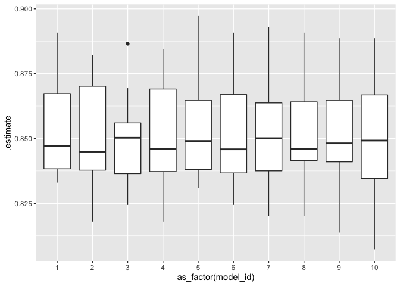<!-- -->

``` r
# Table of top model combinations
hi <- folded %>% group_by(model_id) %>% summarise(.estimate = median(.estimate)) %>% ungroup( )%>% filter(.estimate >model_benchmark) %>% 
  inner_join(xgb_grid) %>% arrange(desc(.estimate))
```

    ## Joining, by = "model_id"

``` r
hi
```

    ## # A tibble: 2 x 7
    ##   model_id .estimate trees min_n tree_depth learn_rate loss_reduction
    ##      <int>     <dbl> <int> <int>      <int>      <dbl>          <dbl>
    ## 1        3     0.850     1    14          2      0.647         0.861 
    ## 2        7     0.850    14    15          1      0.789         0.0995

``` r
#  Variance of model accuracy by paramter values
folded %>% select(trees:model_id,.estimate) %>% group_by(model_id)%>% pivot_longer(trees:loss_reduction) %>% ggplot(aes(x = value,y = .estimate,colour = as_factor(model_id))) + geom_point() + facet_wrap(~name,scales ="free_x") 
```

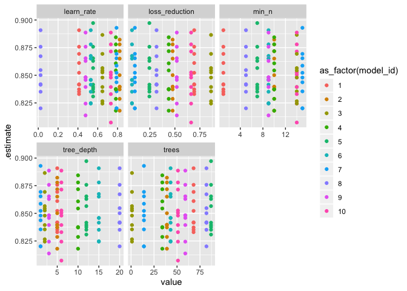<!-- -->

``` r
# Mean accuracy for each parameter values
folded %>% select(trees:model_id,.estimate) %>% group_by(model_id)%>% pivot_longer(trees:loss_reduction) %>% group_by(name,value) %>% summarise(.estimate = mean(.estimate)) %>% ggplot(aes(x = value,y = .estimate)) + geom_point() + facet_wrap(~name,scales ="free_x") 
```

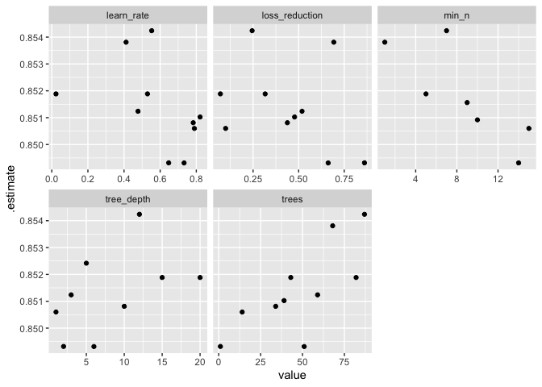<!-- -->

Looking at the graph which shows mean accuracy by parameter. We can see
the following:

*`min_n` performs best when roughly 10. *`trees` perfroms best when
greater than 50 \*`loss_reduction` performs better when greater than
0.25

The other paramters show no clear pattern so will only change the values
for the above.

# Tune 2

``` r
set.seed(seed = 2) 
xgb_grid <- grid_random(
trees(c(50,100)), # Number of boosting iterations
min_n(c(7,13)), # Min number of data points in a node to split it further
tree_depth(c(1,20)), # Number of splits
learn_rate(c(0,1),trans = NULL), # eta
loss_reduction(c(0.3,1),trans = NULL), # gamma
size = 10) %>% mutate(model_id = row_number()) 

xgb_grid
```

    ## # A tibble: 10 x 6
    ##    trees min_n tree_depth learn_rate loss_reduction model_id
    ##  * <int> <int>      <int>      <dbl>          <dbl>    <int>
    ##  1    70    11          8      0.514          0.961        1
    ##  2    64     7          7      0.627          0.856        2
    ##  3    55     8          1      0.844          0.982        3
    ##  4    55     9          9      0.285          0.544        4
    ##  5    81     7         16      0.667          0.651        5
    ##  6    57     9          4      0.150          0.867        6
    ##  7    66    12         11      0.982          0.305        7
    ##  8    78     8          6      0.297          0.310        8
    ##  9    66     9          9      0.115          0.778        9
    ## 10    61    13         14      0.163          0.951       10

``` r
set.seed(seed = 2) 
folds <- vfold_cv(train_set,5,2)

folded <-  folds %>% 
  # Cross join the xvg grid create above
  expand_grid(xgb_grid) %>% 
  # Then create analysis and assesment sets
  mutate(analysis = map(splits, analysis),
  assesment = map(splits, assessment),
  # Create a Recipe. Prepper is a wrapper for `prep()` which handles `split` objects
  recipe = map(splits,~prepper(.x,recipe(location ~ ., data = train_set) %>% 
  step_dummy(primary_fur_color,age,one_hot = T))),
  # Now bake analysis and assesment sets
  analysis = map2(recipe,analysis,bake),
  assesment = map2(recipe,assesment,bake),
  # Run model against analysis set with values for parameter objects defined
  boost_tree = pmap(list(trees,min_n,tree_depth,learn_rate,loss_reduction,analysis),
  ~ boost_tree(mode = "classification",trees= ..1,min_n = ..2,tree_depth= ..3,learn_rate = ..4, loss_reduction =  ..5) %>% 
  set_engine("xgboost") %>%
  fit(location ~ ., data = ..6)
  ),
  # Create predictions for each model on the assesment set
  predictions_xgb = map2(
  assesment,
  boost_tree,
  ~
  predict(.y, new_data = .x) %>%
  bind_cols(.x %>% select(location))
  ),
  # Compute accuracy metric
  accuracy = map(predictions_xgb,~ accuracy(., truth = location, estimate = .pred_class))
  ) %>% 
  unnest(accuracy)


# Visualise model performance by model id
folded %>% ggplot(aes(x = as_factor(model_id), y = .estimate)) + geom_boxplot()
```

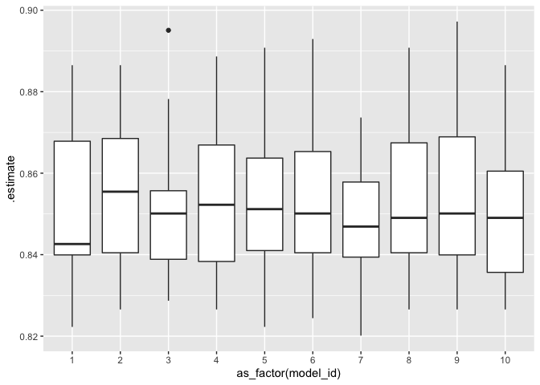<!-- -->

``` r
# Table of top model combinations
hi <- folded %>% group_by(model_id) %>% summarise(.estimate = median(.estimate)) %>% ungroup( )%>% filter(.estimate >model_benchmark) %>% 
  inner_join(xgb_grid) %>% arrange(desc(.estimate))
```

    ## Joining, by = "model_id"

``` r
hi
```

    ## # A tibble: 6 x 7
    ##   model_id .estimate trees min_n tree_depth learn_rate loss_reduction
    ##      <int>     <dbl> <int> <int>      <int>      <dbl>          <dbl>
    ## 1        2     0.855    64     7          7      0.627          0.856
    ## 2        4     0.852    55     9          9      0.285          0.544
    ## 3        5     0.851    81     7         16      0.667          0.651
    ## 4        3     0.850    55     8          1      0.844          0.982
    ## 5        6     0.850    57     9          4      0.150          0.867
    ## 6        9     0.850    66     9          9      0.115          0.778

``` r
#  Variance of model accuracy by paramter values
folded %>% select(trees:model_id,.estimate) %>% group_by(model_id)%>% pivot_longer(trees:loss_reduction) %>% ggplot(aes(x = value,y = .estimate,colour = as_factor(model_id))) + geom_point() + facet_wrap(~name,scales ="free_x") 
```

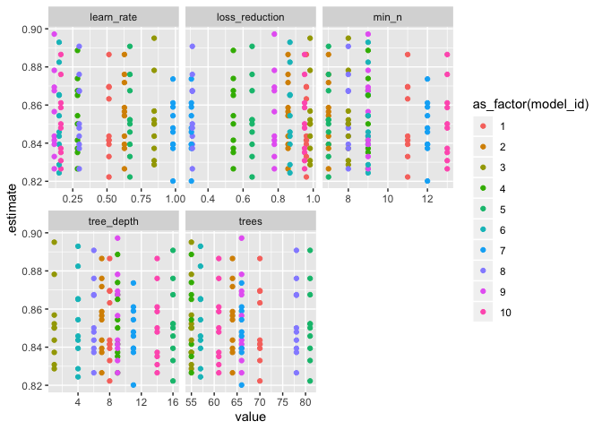<!-- -->

``` r
# Mean accuracy for each parameter values
folded %>% select(trees:model_id,.estimate) %>% group_by(model_id)%>% pivot_longer(trees:loss_reduction) %>% group_by(name,value) %>% summarise(.estimate = mean(.estimate)) %>% ggplot(aes(x = value,y = .estimate)) + geom_point() + facet_wrap(~name,scales ="free_x") 
```

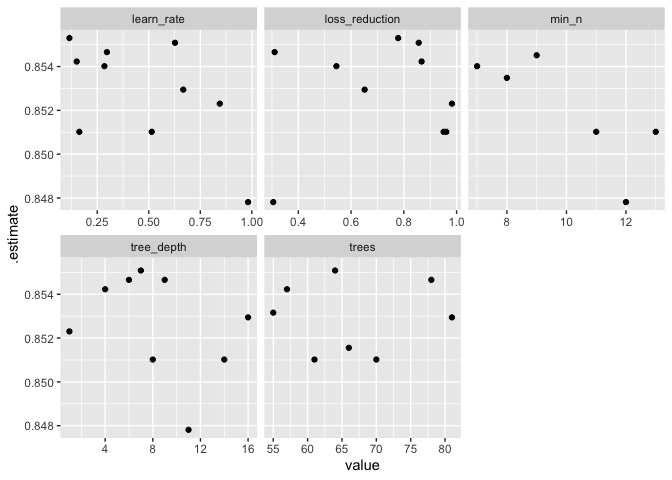<!-- -->

Looking at the graph which shows mean accuracy by parameter. We can see
the following:

*`min_n` performs best between 7 and 9. *`tree_depth` perfroms best
between greater than 4 and 9 \*`loss_reduction` performs better when
less than 0.9

The other paramters show no clear pattern so will only change the values
for the above.

### Tune 3

``` r
set.seed(seed = 3) 
xgb_grid <- grid_random(
trees(c(50,100)), # Number of boosting iterations
min_n(c(7,9)), # Min number of data points in a node to split it further
tree_depth(c(4,9)), # Number of splits
learn_rate(c(0,1),trans = NULL), # eta
loss_reduction(c(0.3,0.9),trans = NULL), # gamma
size = 10) %>% mutate(model_id = row_number()) 

xgb_grid
```

    ## # A tibble: 10 x 6
    ##    trees min_n tree_depth learn_rate loss_reduction model_id
    ##  * <int> <int>      <int>      <dbl>          <dbl>    <int>
    ##  1    54     9          5     0.419           0.807        1
    ##  2    61     7          4     0.268           0.846        2
    ##  3    88     8          7     0.0478          0.583        3
    ##  4    85     7          9     0.103           0.435        4
    ##  5    89     7          7     0.314           0.377        5
    ##  6    92     7          6     0.801           0.468        6
    ##  7    80     7          9     0.229           0.790        7
    ##  8    57     7          5     0.213           0.335        8
    ##  9    69     7          6     0.877           0.782        9
    ## 10    59     8          8     0.993           0.363       10

``` r
set.seed(seed = 3) 
folds <- vfold_cv(train_set,5,2)

folded <-  folds %>% 
  # Cross join the xvg grid create above
  expand_grid(xgb_grid) %>% 
  # Then create analysis and assesment sets
  mutate(analysis = map(splits, analysis),
  assesment = map(splits, assessment),
  # Create a Recipe. Prepper is a wrapper for `prep()` which handles `split` objects
  recipe = map(splits,~prepper(.x,recipe(location ~ ., data = train_set) %>% 
  step_dummy(primary_fur_color,age,one_hot = T))),
  # Now bake analysis and assesment sets
  analysis = map2(recipe,analysis,bake),
  assesment = map2(recipe,assesment,bake),
  # Run model against analysis set with values for parameter objects defined
  boost_tree = pmap(list(trees,min_n,tree_depth,learn_rate,loss_reduction,analysis),
  ~ boost_tree(mode = "classification",trees= ..1,min_n = ..2,tree_depth= ..3,learn_rate = ..4, loss_reduction =  ..5) %>% 
  set_engine("xgboost") %>%
  fit(location ~ ., data = ..6)
  ),
  # Create predictions for each model on the assesment set
  predictions_xgb = map2(
  assesment,
  boost_tree,
  ~
  predict(.y, new_data = .x) %>%
  bind_cols(.x %>% select(location))
  ),
  # Compute accuracy metric
  accuracy = map(predictions_xgb,~ accuracy(., truth = location, estimate = .pred_class))
  ) %>% 
  unnest(accuracy)


# Visualise model performance by model id
folded %>% ggplot(aes(x = as_factor(model_id), y = .estimate)) + geom_boxplot()
```

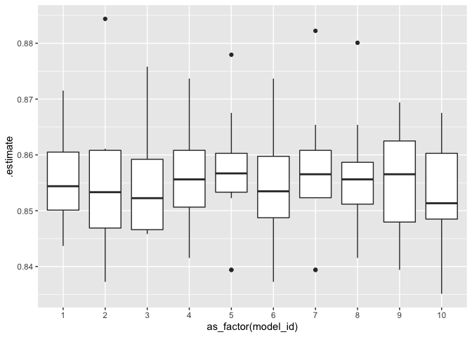<!-- -->

``` r
# Table of top model combinations
hi <- folded %>% group_by(model_id) %>% summarise(.estimate = median(.estimate)) %>% ungroup( )%>% filter(.estimate >model_benchmark) %>% 
  inner_join(xgb_grid) %>% arrange(desc(.estimate))
```

    ## Joining, by = "model_id"

``` r
hi
```

    ## # A tibble: 10 x 7
    ##    model_id .estimate trees min_n tree_depth learn_rate loss_reduction
    ##       <int>     <dbl> <int> <int>      <int>      <dbl>          <dbl>
    ##  1        5     0.857    89     7          7     0.314           0.377
    ##  2        7     0.857    80     7          9     0.229           0.790
    ##  3        9     0.857    69     7          6     0.877           0.782
    ##  4        8     0.856    57     7          5     0.213           0.335
    ##  5        4     0.856    85     7          9     0.103           0.435
    ##  6        1     0.854    54     9          5     0.419           0.807
    ##  7        6     0.853    92     7          6     0.801           0.468
    ##  8        2     0.853    61     7          4     0.268           0.846
    ##  9        3     0.852    88     8          7     0.0478          0.583
    ## 10       10     0.851    59     8          8     0.993           0.363

``` r
#  Variance of model accuracy by paramter values
folded %>% select(trees:model_id,.estimate) %>% group_by(model_id)%>% pivot_longer(trees:loss_reduction) %>% ggplot(aes(x = value,y = .estimate,colour = as_factor(model_id))) + geom_point() + facet_wrap(~name,scales ="free_x") 
```

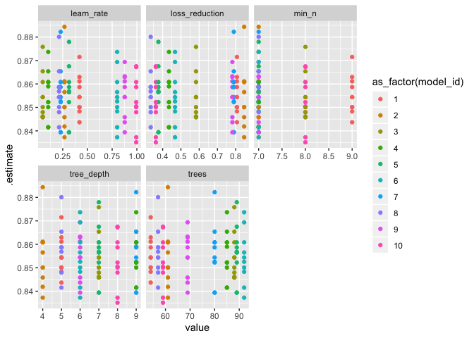<!-- -->

``` r
# Mean accuracy for each parameter values
folded %>% select(trees:model_id,.estimate) %>% group_by(model_id)%>% pivot_longer(trees:loss_reduction) %>% group_by(name,value) %>% summarise(.estimate = mean(.estimate)) %>% ggplot(aes(x = value,y = .estimate)) + geom_point() + facet_wrap(~name,scales ="free_x") 
```

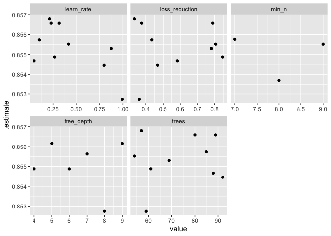<!-- -->

## Choose parameters

Our best performing model was using the following parameters:

Now let’s use this on the testing set.

### Fit the model

``` r
set.seed(seed = 1) 
boost_tree <-
  boost_tree(
  mode = "classification",
  trees = 89,
  min_n = 7,
  tree_depth = 7,
  learn_rate = 0.314,
  loss_reduction = 0.377
  ) %>%
  set_engine("xgboost") %>%
  fit(location ~ ., data = train_baked)

importance <- xgb.importance(feature_names = colnames(train_baked %>% select(-location)),model = boost_tree$fit)

xgb.plot.importance(importance)
```

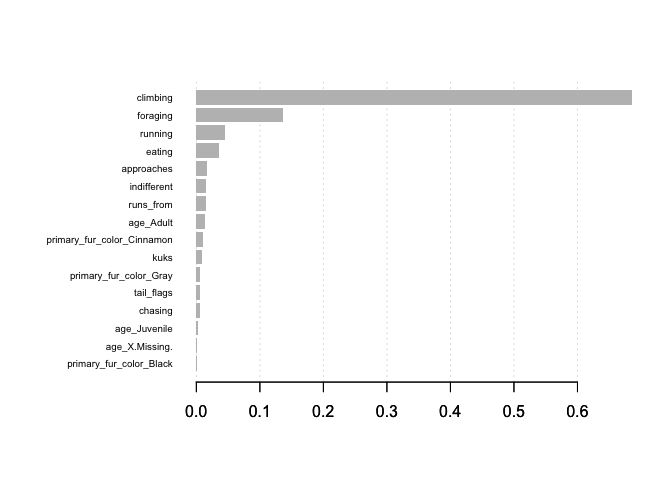<!-- -->

### Performance Assesment

``` r
predictions_xgb <- boost_tree %>% 
  predict(new_data = test_baked) %>% 
  bind_cols(test_baked %>% select(location))
```

``` r
predictions_xgb %>%
  conf_mat(location, .pred_class) %>%
  pluck(1) %>%
  as_tibble() %>%
  ggplot(aes(Prediction, Truth, alpha = n)) +
  geom_tile(show.legend = FALSE) +
  geom_text(aes(label = n), colour = "white", alpha = 1, size = 8)
```

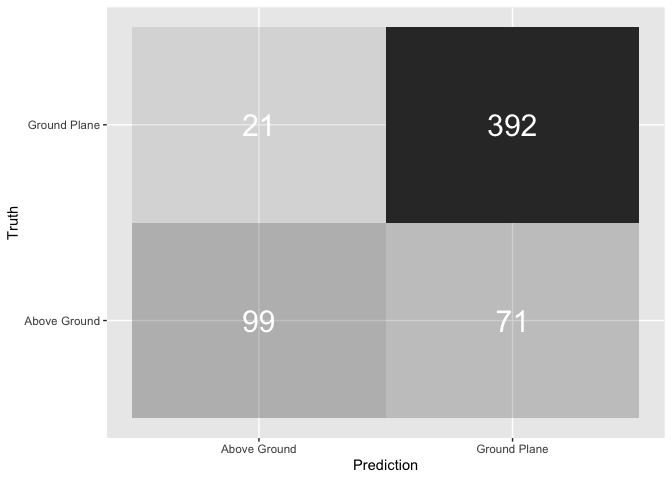<!-- -->

``` r
predictions_xgb %>%
  conf_mat(location, .pred_class) %>% summary() %>% 
  select(-.estimator) %>%
  filter(.metric %in%
    c("accuracy", "precision", "recall", "f_meas")) %>%
  kable(digits = 2)
```

| .metric   | .estimate |
| :-------- | --------: |
| accuracy  |      0.84 |
| precision |      0.85 |
| recall    |      0.95 |
| f\_meas   |      0.89 |

### Next Steps: Fit the metalearner

Use a multinomial regression as the metalearner.
