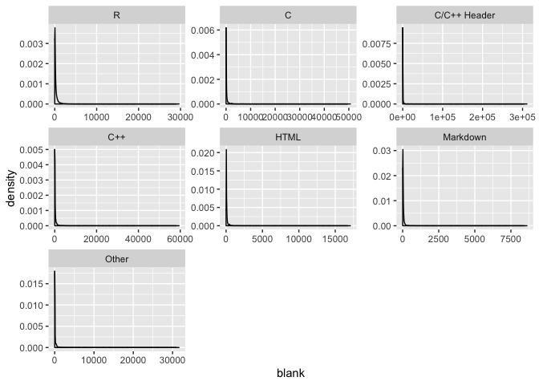

2019-11-12 Code in CRAN packages
================

With this dataset I am going to work on a Boostrapping techniques to
find the difference in means of blank lines for R packages between R and
other languages.

## Read in the data

Clean data and use `fct_lump` to group languages used less frequently as
“Other”.

``` r
cran_code_raw <- readr::read_csv("https://raw.githubusercontent.com/rfordatascience/tidytuesday/master/data/2019/2019-11-12/loc_cran_packages.csv")
```

    ## Parsed with column specification:
    ## cols(
    ##   file = col_double(),
    ##   language = col_character(),
    ##   blank = col_double(),
    ##   comment = col_double(),
    ##   code = col_double(),
    ##   pkg_name = col_character(),
    ##   version = col_character()
    ## )

``` r
cran_code <- cran_code_raw %>% mutate(language = fct_lump(language,6),
                                      language = fct_relevel(language,"R"))
```

The graph below show the data is right skewed for each group.

Boostrapping is the correct approach to take in this case as we won’t be
able to rely on the assumptions of Analysis of Variance to deem it the
results reliable.

``` r
cran_code %>% ggplot(aes(blank)) + geom_density() + facet_wrap(~language, scales = "free")
```

<!-- -->

### Bootstrap to understand difference of means for blank lines

Set Hypothesis (for each langauge other than R)

  - H0 - There is no difference between the average number of blank
    lines between R and the other languages
  - HA - There is a difference between average number of blank lines
    between R and the other languages

<!-- end list -->

1.  Take a bootstrap sample of each sample
2.  Calculate the bootstrap statistic
3.  Repeat steps (1) and (2) many times to create a bootstrap
    distribution - a distribution of bootstrap statistics.
4.  Calculate the interval using the percentile or the standard error
    method.

Using `rsample` package we can easily create 2,000 `bootstraps`.

``` r
set.seed(17)
boots <- bootstraps(cran_code,times = 2000,strata = language)
```

We create a helper function to calculate the difference in means on each
bootstrap sample, and then use `purrr::map` to apply this function to
all the bootstrap samples at once.

``` r
mean_per_language <- function(splits) {
    means <- analysis(splits) %>% group_by(language) %>% summarise(mean = mean(blank))
    r_mean <- means %>% filter(language =="R") %>% select(mean) %>% pull()
    means %>% mutate(diff = r_mean - mean)
}
boot_means <- boots %>%
mutate(model = map(splits, mean_per_language))  %>% unnest(model) %>% filter(language !=
"R") %>% mutate(language = fct_reorder(language, diff))

boot_means %>% ggplot(aes(x = diff)) + geom_histogram() + facet_wrap( ~
language,scales = "free_x") + ggtitle("The distribution of the difference in means compared to `R` for each language.")
```

    ## `stat_bin()` using `bins = 30`. Pick better value with `binwidth`.

<!-- -->

### Calculate confidence interval

Calculate the confidence interval for the difference in means and plot.

``` r
boot_means_conf <- boot_means %>% group_by(language) %>% summarise(avg_diff = mean(diff),
                                                lower_conf = quantile(diff,c(0.025)),
                                                higher_conf = quantile(diff,c(0.975))) %>%
  ungroup() 

boot_means_conf %>% ggplot(aes(x = language, y = avg_diff)) + geom_point()+geom_errorbar(aes(ymin = lower_conf,ymax = higher_conf)) + coord_flip() +
   labs(title = "Bootstrap",
        subtitle = "Confidence bands for the difference in average blank lines compared to R.") 
```

<!-- -->

This shows that on average, for R packages, the R language has at least
250 more blank lines than Markdown. Conversely, we see R has less than
(at least) 100 blank lines than C/C++ Header.

### Comparison to Tukey HSD

Now calculate confidence intervals using Tukeys HSD to compare results
to the bootstrap approach.

``` r
tukey_means_diff <- cran_code %>% aov(blank ~ language,data = .) %>% TukeyHSD() %>% tidy() %>% filter(str_detect(comparison,"R")) %>% 
  mutate_if(is.numeric,~-.) %>% 
  mutate(language = str_remove(comparison,"-R"),
         language = fct_reorder(language, estimate))

tukey_means_diff %>% 
  ggplot(aes(x = language, y = estimate)) + geom_point()+
  geom_errorbar(aes(ymin = conf.low,ymax = conf.high)) + coord_flip() +
   labs(title = "TukeyHSD Test",
        subtitle = "Confidence bands for the difference in average blank lines compared to R.") 
```

<!-- -->

``` r
joined <- tukey_means_diff %>% inner_join(boot_means_conf) %>% mutate(language = fct_reorder(language,estimate)) 
```

    ## Joining, by = "language"

    ## Warning: Column `language` joining factors with different levels, coercing
    ## to character vector

``` r
joined %>% select(language,everything(),-term,-comparison,adj.p.value) %>%  kable()
```

| language     |    estimate |    conf.low |    conf.high | adj.p.value |   avg\_diff | lower\_conf | higher\_conf |
| :----------- | ----------: | ----------: | -----------: | ----------: | ----------: | ----------: | -----------: |
| C            | \-103.40171 |    32.82943 | \-239.632838 | \-0.2751466 | \-102.48244 | \-184.21630 |   \-30.94213 |
| C/C++ Header | \-362.75930 | \-217.44883 | \-508.069780 |   0.0000000 | \-366.55020 | \-768.94818 |  \-112.13132 |
| C++          |  \-60.86752 |    78.83937 | \-200.574416 | \-0.8593087 |  \-60.52124 | \-160.54932 |     19.67359 |
| HTML         |   190.46210 |   299.48311 |    81.441080 | \-0.0000054 |   190.24953 |   171.87436 |    207.72504 |
| Markdown     |   262.71296 |   354.94414 |   170.481778 |   0.0000000 |   262.67595 |   250.52930 |    275.99514 |
| Other        |   104.75981 |   207.04641 |     2.473207 | \-0.0405892 |   105.53149 |    67.38833 |    141.45093 |

This table shows that the estimates from the bootsrap and TukeyHSD are
very similar. However, the confidence intervals differ wildly. This is
because for the Tukey test to be significant it needs to follow certain
assumptions. One assumption is that the data needs to be normally
distributed, from the density plots above it is clear this isn’t true.
Such, confidence intervals for this test cannot be trusted.

Below displays the difference in confidence intervals.

``` r
joined %>% 
  ggplot(aes(x = language)) + 
  geom_point(aes(y = avg_diff,colour = "Boostrap")) +  
  geom_errorbar(aes(ymin = lower_conf,ymax = higher_conf,colour = "Boostrap")) +
  geom_point(aes(y = estimate,alpha = 0.01, colour = "Tukey HSD")) + 
  geom_errorbar(aes(ymin = conf.low,ymax = conf.high, colour = "Tukey HSD")) + coord_flip() +
    labs(title = "Boostrap vs Tukey HSD",
         subtitle = "Confidence bands for the difference in average blank lines compared to R.",
       colour = "Statistical Test") +
  guides(alpha = F)
```

<!-- -->
